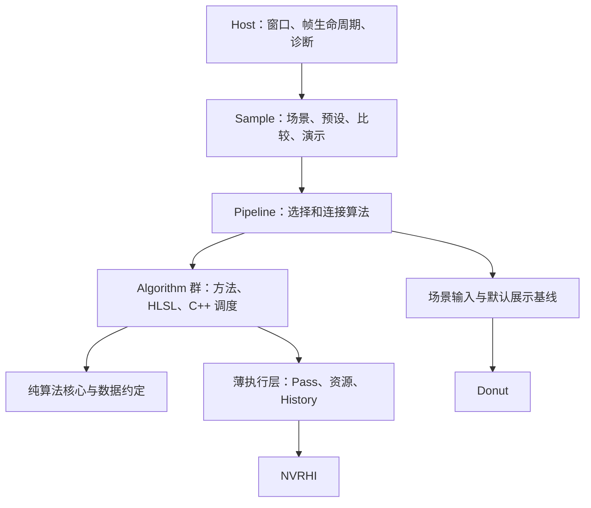

> Historical review: paths and implementation status below describe the pre-refactor tree. See [current architecture](architecture.md).

# PrismLab 架构审查与渲染实验路线

日期：2026-09-22。依据当前仓库源码、README 引用的原有研究路线图，以及文中链接的官方技术资料。本文区分现有实现、第三方可复用能力和建议建设内容；本次未执行构建、运行样例或测量 GPU 性能。下述新类型与目录均是设计建议。

**核心判断：Prism 已经建立了较完整的实验宿主。下一步应补齐“可复用的 Algorithm 群 + 公共渲染输入 + 展示与比较”的中间层，让新增研究主要集中在 HLSL、GPU 数据结构和 C++ 调度。** 当前距离目标最大的差距，是实验能运行与算法能低成本组合之间的差距。

## 1. 当前架构实际做到了什么

| 部分 | 已有实现 | 对目标的意义 / 限制 |
|---|---|---|
| 应用宿主 | Application、Experiment、ExperimentRenderPass、相机、窗口、设备、UI、帧循环 | 应用层样板代码已明显减少，值得保留 |
| 构建 | CMake、prism_add_target、prism.ps1、独立 Sample 配置 | 新实验已有统一入口；规模扩大后需改 shader 输出命名空间和目标发现 |
| 场景 | 程序几何、Donut glTF 加载、GeometryBatch、LightRecord | 能提供基础场景；自绘路径的动态同步与 GPU 材质查询不足 |
| 执行设施 | Texture/Buffer pool、ResourceTable、ShaderLibrary、Fullscreen/Compute helpers | 封装了部分 API 操作，仍未管理一个 Pass 的完整重复工作 |
| 数据约定 | CameraData、FrameInfo、SurfaceData、深度/颜色约定、ContractExperiment | 是后续复用的良好基础；数据类型存在不等于相应 GPU 信号已生成 |
| 实验诊断 | 中间纹理、GPU query、CSV、截图、浮点参考图、smoke/bench | 已有基础，但计时范围和最终截图需要修正 |
| 渲染管线 | SceneForwardPipeline 包装 Donut ForwardShadingPass | 主要是前向基线；GBuffer、Velocity、Hi-Z、RT Scene 尚未形成公共服务 |
| 算法 | PCF/HLSL 桥接原型、公共调试 shader；Forward/Contract/Starter | 还没有完整的技术族 Algorithm + Sample 闭环 |
| 时域 / 显示 | ITemporalServices、IDisplayChain 接口 | 没有默认实现；时域接口本身也缺历史资源获取与帧提交方法 |

关键依据：[Experiment](E:/PrismLab/framework/host/Experiment.h:141)、[构建入口](E:/PrismLab/CMakeLists.txt:121)、[前向管线](E:/PrismLab/framework/pipelines/SceneForwardPipeline.cpp:20)、[时域接口](E:/PrismLab/framework/host/TemporalServices.h:32)、[显示接口](E:/PrismLab/framework/host/DisplayChain.h:42)。

一个很直观的样板代码指标是 [ForwardExperiment::EnsureDebugPass](E:/PrismLab/samples/forward/forward.cpp:86)：只是一个全屏深度调试 Pass，Sample 仍需要维护常量缓冲、绑定布局、绑定集、PSO、framebuffer、输入纹理变化检查以及 resize 后失效。这些工作应该被公共设施吸收。

另外，当前源码采用 Donut 的行向量矩阵约定 `mul(v, M)`，见 [Platform.hlsli](E:/PrismLab/algorithms/shaders/Prism/Common/Platform.hlsli:6)。原有外部路线图部分文字采用 `mul(M, v)`，后续应统一文档到已经通过契约验证的实际约定，避免同时传播两套规则。

## 2. Algorithm 群与 Sample 的边界

建议保留每个大类一个独立 Sample：`Shadows → ShadowLab`、`AmbientOcclusion → AOLab`。PCF、PCSS、EVSM 等作为 Shadows 内的方法，不各自复制一个应用。其他 Sample 可以复用 Shadows；“对应一个 Sample”表示主要展示入口，不表示算法只能在该 Sample 中使用。

**Algorithm 群必须包含算法相关的 C++ 调度。** 当前 README 把 algorithms 限定为纯 HLSL、所有 C++ 放在 framework。继续坚持这个目录规则，会把新技术的 Pass 调度挤入 Sample 或 framework/pipelines，削弱算法复用。建议把可移植边界收缩为群内的纯算法核心：

```text
algorithms/
  shadows/
    ShadowSettings.h           参数与方法枚举
    ShadowInputs.h             本技术族的具体输入输出
    ShadowMapPass.h/.cpp        几何到阴影图的调度
    ShadowResolvePass.h/.cpp    阴影求值的调度
    ShadowSystem.h/.cpp         多 Pass 组合与算法私有状态
    shaders/
      core/                    PCF、PCSS、矩方法等纯函数
      passes/                  实际 shader entry points
      bridge/                  场景/资源访问适配
samples/
  shadows/
    ShadowSample.h/.cpp        场景、技术选择、演示和比较
    presets/                  算法、镜头、灯光与展示预设
    CMakeLists.txt
framework/
  host/                       应用与实验操作
  nvrhi/                      公共执行、资源、缓存与诊断
  donut/                      场景加载与数据适配
  pipelines/                  可选的公共场景/展示基线
```

这是职责划分，落地时沿用已有目录风格即可，不需要一次移动全仓库。Algorithm 的 C++ 可以依赖 NVRHI 和明确的公共服务；不要读取 ImGui 状态、配置文件、窗口或全局相机。纯 HLSL 核心保留 PRISM_* 桥接。跨引擎移植时可复用数学与 shader 核心，资源绑定和 C++ 后端调度允许重写。

迁移时要同步调整 CMake 依赖：当前 `prism_nvrhi` 依赖只含 shader 的 `prism_algorithms` INTERFACE 目标。不能把这个同名目标直接改成又依赖 `prism_nvrhi` 的 C++ 技术库，否则形成循环。保留/拆出纯 `prism_shader_core` 供底层共享，各技术群单独形成 `prism_shadows` 等库，依赖 `prism_nvrhi`，再由 pipelines/sample 依赖技术群。History、sampling、Pass 等低层服务也不应接受 `ExperimentContext` 或包含 UI；Host 负责生命周期和 UI 适配，避免算法反向依赖 `prism_host`。



不要建立覆盖所有领域的 `IAlgorithm::Execute(map<string, void*>)`。BRDF 是求值/采样函数，阴影是多 Pass 系统，GI 还可能维护探针缓存，它们不需要相同执行接口。每个族保留具体的 Settings / Inputs / Outputs / Record，只有实验元数据和 UI 操作共享轻量描述。

以下仅为使用形态示意，并非当前可编译 API：

```cpp
auto surface = scenePipeline.RecordSurface(frame, requirements);
auto shadow = shadows.Record(frame, sceneGpu, surface, shadowSettings);
auto ao = ambientOcclusion.Record(frame, surface, aoSettings);
auto hdr = lighting.Record(frame, surface, shadow, ao, lightSettings);
return presentation.Record(frame, hdr, presentationSettings);
```

函数看起来简短，不意味着必须把整个场景都做成屏幕空间。PCF 核心也可以内嵌在前向光照 shader，省掉独立 resolve。具体 Pass 划分由算法作者决定。

## 3. 应补齐的公共封装

### 3.1 Pass 执行与 Shader 迭代：首先减少每天重复写的代码

在现有 PipelineUtils 基础上提供小型 `ComputePass`、`FullscreenPass`、`RasterPass`：管理 shader/PSO/layout、绑定缓存、常量上传、viewport、按线程组尺寸计算 dispatch、GPU marker 和计时。绑定输入保持有类型、显式寄存器或明确描述，不需要先建设全自动反射系统。

缓存要区分 shader 版本、宏变体、layout、render state、attachment 格式/采样数，以及资源 generation。纹理 resize 不必无条件重建格式兼容的 PSO；实际绑定与 framebuffer 按真实依赖失效。

新增一条完整编辑链：编译 shader → 检查错误 → 成功后替换相关 shader/PSO → 失败时继续使用上一份可运行版本。现有 [ShaderLibrary::ClearCache](E:/PrismLab/framework/nvrhi/ShaderLibrary.cpp:114) 只是清缓存，不能称为已实现热重载。第一版可使用手动 reload 按键，随后再增加文件监听。

**不应封装掉** dispatch 顺序、线程组实验、barrier 的特殊需求、算法 GPU 数据结构、射线生成和采样策略。任何 helper 都应允许直接拿 NVRHI command list 完成特殊操作。

### 3.2 SceneSurfacePipeline：让屏幕空间和时域算法拿到一致输入

公共输入按需生成：depth、linear depth、几何/着色法线、粗糙度、材质参数、emissive、velocity、instance/material ID 和 Hi-Z。不要让 AO、SSR、TAA、SSGI 分别重新造一套 GBuffer。

现有 [GBufferSchema](E:/PrismLab/framework/types/SurfaceData.h:29) 只是约定。Donut 的 GBuffer 可作为生产者，但不能直接重命名纹理：

- Donut 的 [GBuffer shader](E:/PrismLab/external/Donut-Samples/donut/shaders/passes/gbuffer_ps.hlsl:76) 输出 diffuse albedo / specular F0 等，Prism schema 使用 baseColor / metalness。
- Donut 的 [运动矢量](E:/PrismLab/external/Donut-Samples/donut/include/donut/shaders/motion_vectors.hlsli:38) 使用像素单位，Prism 约定使用 UV 单位；必须按相应 viewport 变换，并保持当前/前帧 jitter 约定一致。
- 格式、法线编码、alpha mask、透明表面和多层表面需要明确适配，不能靠字段同名假设兼容。

建议使用明确的 Surface 访问桥接，或自定义 GBuffer PS；避免强行从有信息损失的材质表示反推原始参数。普通延迟 GBuffer 也不能承诺无损表达任意分层 BSDF、透明物体和毛发，复杂路径需要 forward/custom material evaluation 出口。

### 3.3 ResourceScope + HistoryStore：稳定身份与跨帧状态

当前 ResourceTable 的 Get 最终仍按字符串名称找资源，见 [ResourceTable](E:/PrismLab/framework/nvrhi/ResourceTable.h:110) 和 [RenderTargetPool](E:/PrismLab/framework/nvrhi/RenderTargetPool.cpp:35)。同一进程内两个 AO 实例或 A/B 两套方法可能争用同名资源；独立 Sample EXE 之间不存在这个问题。

建议以 `AlgorithmInstance / View / Slot` 标识资源，显示名称仅用于诊断。提供 render-size、output-size、fixed-size 三类尺寸，以及 transient、persistent、history 三类寿命。补 generation 与资源视图，resize、方法切换、shader reload 后可以正确处理缓存。

按真实使用场景补充 Texture 3D/cube、MSAA、mip/layer view、整数格式。当前 [TextureRequest](E:/PrismLab/framework/nvrhi/RenderTargetPool.h:25) 有 arraySize/mipLevels，但没有 dimension、volume depth、sample count；不能把它视为已经支持体积、立方体和 MSAA 全部资源形式。现有池是命名缓存，并非自动瞬态别名分配器，暂时无需做显存 aliasing。

时域需要真正的 `HistoryTexture` / `HistoryBuffer`：获取上一帧只读与当前帧写入槽、valid/generation、帧开始/结束推进、提交成功后交换、owner/view 隔离、局部重置。重置来源包括 camera cut、尺寸、技术切换、材质/光照变化和关键参数变化；各算法决定哪些变化可保留历史。CPU 帧槽与 GPU 多帧在途的使用必须正确衔接，不能简单认为两个纹理就自动解决所有同步问题。

另提供 SamplingContext（frame、pixel、stream、seed）、低差异序列、blue noise。HistoryStore 只管资源与生命周期；重投影、clamp、disocclusion、滤波权重属于算法。

### 3.4 SceneFrameData / SceneGpuData：共享光栅、光追与 GPU Driven 的场景表示

目前 GeometryBatch 含 CPU 绘制记录，且变换在加载时复制；[SceneHost::Update](E:/PrismLab/framework/donut/SceneHost.cpp:98) 只刷新 Donut Scene，不同步已复制的 draw transforms、bounds 和 LightRecord。这会阻碍自绘路径的动态物体运动矢量、RT 更新和 GPU 剔除。

需要稳定 instance/material/mesh/light ID、current/previous transforms、dirty flags、scene revision、统一动画时间；逐步提供 GPU 顶点/索引/材质/纹理/光源表，以及可复用的命中材质求值。alpha test、双面、透明、蒙皮和形变必须显式支持或明确排除。

光源需从当前方向/点/聚光，扩展到面积光、自发光三角形和环境分布；采样 API 约定 measure、PDF、单位与坐标。BRDF Evaluate / Sample / Pdf 是 ReSTIR 和路径追踪的重要共同基础。

### 3.5 RayTracingScene：集中处理光追工程工作

在选第一个 RT 课题时加入：BLAS build/cache/update、TLAS instance update、必要的 compact/refit 策略、几何/材质 hit 查询；支持 RayQuery，按需求再增加 RT pipeline / SBT。Algorithm 负责射线、采样、积分与着色。

Donut 的 [rt_bindless](E:/PrismLab/external/Donut-Samples/examples/rt_bindless/rt_bindless.cpp:334) 等示例可供提炼，NVRHI 有相应底层能力；这些都不等于 Prism 现在已维护 RT Scene。SceneGpuData 与透明/动态几何支持必须和光栅路径保持一致。

### 3.6 PresentationPipeline：提供稳定、美观的默认展示

当前共享前向管线没有接入环境探针；[PrepareLights](E:/PrismLab/framework/pipelines/SceneForwardPipeline.cpp:36) 的探针列表为空。DisplayChain 未实现时 HDR 直接 blit。为了做出有美感的演示，优先接入环境/IBL、可控灯光、曝光、tone mapping、正确输出编码，再加入克制的 bloom 和调色。

默认展示链可复用 Donut 的 Sky/EnvironmentMap、LightProbeProcessing、Bloom、ToneMapping。研究某个技术时，再替换对应模块。研究 AO 不需要先独立实现天空、BRDF LUT 和摄影后处理。

必须区分 SceneLinear、PreExposed、DisplayLinear、EncodedOutput，记录曝光值与 working/display gamut。现有 ColorSpace 更接近处理阶段标签，尚不能代表完整色彩管理。给调试数据专用显示路径，防止法线、深度、误差图经过曝光与 tone mapping。

不存在适用于所有重建 SDK 的固定 Pass 顺序。先写清自己的场景线性 HDR、重建、bloom、tone mapping 管线；接入 SDK 时遵守其 HDR、exposure、motion 输入及插入位置约定。

### 3.7 参数、技术切换与演示预设

现有 ParamTable 已有 UI/JSON/hash，但 [参数种类](E:/PrismLab/framework/host/Params.h:49) 只有 Bool/Int/Float，Forward 尚在手写 JSON 和控件。建议增加 enum、vector/color、分组、单位、对数 slider、预设保存/恢复，以及 ChangeImpact：仅常量、历史失效、PSO 重建、场景更新。

Sample 使用轻量 TechniqueDesc：稳定 ID、名称、能力需求、参数表、说明、输入需求。方法切换要协调资源与历史；可以保留每种方法的参数，但不能误用另一方法的历史。共享输出只统一语义，不强迫所有方法使用相同 Pass 划分。

调试视图使用稳定 ID，替代当前依赖发布顺序的索引。对比提供 A/B、wipe、difference、freeze、同步镜头；多视图或 A/B 的资源与历史独立命名。

### 3.8 能力、构建与按需服务

每个方法声明所需的 DXR、Mesh Shader、shader profile、格式/原子操作、SDK/模型和内存要求。初始化时检测能力，不支持时在 UI 解释并禁用，不应悄悄切到另一个方法污染比较。研究用场景、前向管线和 RT Scene 按需求启用，compute/纹理样例不必强制加载前向场景。

当前 [CMake shader 规则](E:/PrismLab/CMakeLists.txt:162) 固定 `main_<stage>`，没有透传每个目标的 Shader Model/完整变体需求；[公共输出 --flatten](E:/PrismLab/CMakeLists.txt:189) 会让不同技术群中的同名 `resolve.hlsl` 等产生碰撞。应按 Algorithm/Pass 命名空间输出，并支持 entry、profile、defines、library。运行脚本也应从 Sample 清单取目标，不继续硬编码三个名称。

全工程继续以单队列和显式 C++ 顺序为默认。只有 GPUExecution 等确实研究并行提交的 Sample，才增加有范围的 command list/queue/fence 接口。Work Graphs、专用 SDK 和 native D3D12 允许受控的扩展出口；不用为了这些功能重写整套 RHI。

## 4. 在扩展前修正实验结果的可信度

这些是源码层面可定位的问题，不是本次实测结论：

| 问题 | 代码依据 | 对目标的影响与建议 |
|---|---|---|
| 嵌套计时与 flat 实现不一致 | Host 包外层，Forward 包内层；[EndScope](E:/PrismLab/framework/nvrhi/GpuProfiler.cpp:102) 结束全部 active scope，[GetTotalMilliseconds](E:/PrismLab/framework/nvrhi/GpuProfiler.cpp:117) 累加全部范围 | 外层被提前结束且重复计时；单独测完整帧，Pass 支持嵌套或严格平铺 |
| query 未 ready 的槽位仍可能重用 | [poll](E:/PrismLab/framework/nvrhi/GpuProfiler.cpp:65) 未完成仅 continue，后续 BeginScope 未检查槽位可用 | 管理每个 query 的 in-flight 状态，结果携带 GPU 来源 frame ID，结束测量时收完结果 |
| 显示链不在现有测量区间 | [EndFrame 在 DisplayChain 前](E:/PrismLab/framework/host/ExperimentHost.cpp:317) | 分开记录算法时间与完整展示时间，不把 scope 求和当整帧时间 |
| 截图取显示链前的纹理 | [capture](E:/PrismLab/framework/host/ExperimentHost.cpp:423) 读取 m_OutputTexture，而 DisplayChain 写 swapchain | 输出显式区分 HDR scene result、display result、含 UI 结果，选择对应截图 |
| 动态回放尚不确定 | Animate 使用实际 elapsed，FrameInfo 使用平均帧时间 | 固定 timestep、seed、camera path、scene time，支持暂停单步 |

在现有 CSV 与浮点图像比较基础上，保存 run manifest：完整参数、算法与 shader 版本、scene/asset、相机、时间/seed、render/output size、GPU/driver、构建配置、预热/测量窗口。随机算法除了固定种子回归，还需要多 seed 统计、收敛与误差；一张图的最大像素误差不能替代 Monte Carlo 估计质量。

A/B 展示可同帧绘制两份结果，但正式基准应单独运行各方法，使用相同输入与镜头，避免同时运行造成缓存和资源竞争。auto exposure 对比时锁定或共享；分析 HDR 误差时在显示变换之前比较。

## 5. 建议的 Algorithm 群与 Sample 技术版图

下表是长期支持版图，不要求立即创建所有目录。每组一个主要 Sample，组内自由切换方法、参数、质量和诊断。左侧经典实现适合建立 baseline，右侧研究项往往需要额外资产、缓存或训练系统；“可开展研究”不等于“现有硬件下可实时”。

| Algorithm 群 → Sample | 经典与现代方法 | 深入 / 前沿方向 | 展示主题 |
|---|---|---|---|
| Shadows → ShadowLab | Shadow Map、PCF、Poisson、PCSS、CSM、VSM/EVSM/MSM、Contact Shadow | 随机 RT 软阴影、时空重建、Virtual Shadow Maps、透明阴影 | 百叶窗、柱廊、雕塑庭院 |
| SurfaceShading → MaterialLab | Lambert、GGX、Fresnel、IBL、VNDF/MIS、白炉、多散射补偿 | 各向异性、clear coat、薄膜、分层 BSDF、glints、随机纹理过滤 | 金属、陶瓷、珠宝和车漆 |
| Subsurface → SubsurfaceLab | Wrap、Diffusion Profile、SSSS、Separable SSS、厚度透射 | 随机游走参考、异质介质、分层皮肤 | 玉石、蜡、皮肤、树脂 |
| HairAndCloth → FiberLab | Kajiya–Kay、Marschner、Sheen、Strands、透明覆盖 | 多重散射、纤维微结构、毛发 LOD 与重建 | 发束、毛绒、丝绸 |
| DirectLighting → LightLab | Forward/Deferred、Tiled/Clustered、LTC、IES、Alias/Light Tree、RIS | ReSTIR DI、可见性复用、复杂发光面采样 | 夜市、暖色室内、灯光装置 |
| AmbientOcclusion → AOLab | SSAO、HBAO、GTAO、Bent Normal、半分辨率/上采样 | RTAO、方向性遮蔽与时域稳定 | 石雕、机械、建筑接触细节 |
| GlobalIllumination → GILab | Lightmap、SH/PRT、RSM、LPV、SSGI、Voxel Cone Tracing | DDGI、Surfel/Probe/Radiance Cache、Clipmap、ReSTIR GI | 彩色间接光、开关门室内 |
| ReflectionsAndTransmission → ReflectionLab | Planar、Cubemap/Probe、Parallax Correction、SSR/Hi-Z、粗糙反射、折射 | 混合 SSR/Probe/RT、多界面、色散、焦散追踪实验 | 雨夜、镜厅、玻璃工作室 |
| PathTracing → PathTracingLab | BLAS/TLAS、RayQuery/DXR、NEE、MIS、RR、环境采样、渐进累积 | Wavefront、ReSTIR PT、Path Guiding、BDPT、MLT、Photon Mapping、谱渲染 | 高质量静物与参考图 |
| Denoising → DenoiseLab | Bilateral、À-trous、Moments/Variance、SVGF 类滤波 | Reprojection/Disocclusion、信号专用重建、NRD 对照 | 低 spp 室内、快速运动与显露 |
| Reconstruction → ReconstructionLab | MSAA、FXAA、SMAA、TAA、TAAU、Checkerboard、锐化 | FSR/DLSS/XeSS 等适配、Ray Reconstruction、光流/插帧研究 | 栅栏、细线、植被、平移镜头 |
| AtmosphereAndClouds → SkyLab | 解析天空、Rayleigh/Mie、散射 LUT、云密度与 ray marching | 多散射近似、云阴影、时域重建、空区跳过 | 日出山谷、暴风云、日落 |
| ParticipatingMedia → VolumeLab | 吸收/散射、相函数、体积 ray marching、Froxel、体积阴影 | 多次散射、稀疏体积、异质介质追踪 | 教堂光束、雾林、彩烟 |
| WaterAndOcean → OceanLab | Gerstner、FFT 波谱、法线/泡沫、反射折射、Beer–Lambert | 浅水、岸线、波浪细节、水下散射、焦散 | 日落海岸、浅池、溪流 |
| Transparency → TransparencyLab | 排序混合、Depth Peeling、Weighted Blended OIT、PPLL | 随机透明、时域覆盖、多层合成 | 彩色玻璃、多层烟雾 |
| ParticlesAndFluids → ParticleLab | GPU 发射/更新、排序、压缩、Indirect、Curl Noise、软粒子 | SPH/PBF、网格流体、屏幕空间流体、体积火焰 | 火花、喷泉、染料流动 |
| GPUDrivenVisibility → VisibilityLab | Instancing、Frustum/Hi-Z Culling、GPU LOD、Indirect、Meshlet | Mesh Shader、Visibility Buffer、Cluster LOD、虚拟几何与软件光栅研究 | 城市、遗迹、机械阵列 |
| GeometryAndTerrain → GeometryLab | Tessellation、POM/Displacement、Skinning、Morph、Heightfield/Clipmap、植被风场 | SDF/Sphere Tracing、Marching Cubes、隐式表面、自适应细分、程序分布 | 山地、草原、形变雕塑 |
| TexturingAndVirtualResources → TextureLab | Mip/导数/Anisotropy、法线过滤、压缩误差、Noise、稀疏表示 | Virtual Texture、Sampler Feedback、驻留/流送、纹理合成、几何页缓存服务 | 扫描地表、高细节近景 |
| CameraAndColor → CameraLab | 曝光、直方图、Bloom、Tone Mapping、LUT、DOF、Motion Blur | 局部曝光、物理镜头近似、色域映射、HDR 输出 | 摄影棚、夜景、逆光镜头 |
| Stylization → StylizedLab | Toon、描边、Hatching、调色板、像素风、风格化高光 | 几何感知笔触、时域稳定 NPR、风格化阴影 | 水墨建筑、插画静物 |
| GaussianSplatting → SplatLab | 投影、Tile Binning、排序、Alpha 合成、SH 着色 | 抗锯齿、LOD/压缩、流送、Mesh–Splat 混合、动态表示 | 实景扫描、精致小型展品 |
| NeuralRendering → NeuralLab | NeRF/神经场基线、小 MLP 材质/纹理逼近 | 神经纹理压缩、Neural Radiance Cache、神经材质、Cooperative Vector 推理 | 材质压缩、间接光和表示对照 |
| GPUExecution → GpuLab | Scan、Reduce、Sort、Compaction、Wave、共享内存、Bindless、带宽实验 | Async Compute、并行录制、Work Graphs、Render Graph/别名调度研究 | 可视化数据流、负载分布与计时 |

还可按兴趣独立增加 `InverseRendering → InverseLab`（逆材质、逆光照、可微渲染）和 `XRRendering → XRLab`（多视图、VRS、注视点渲染、畸变与重投影）。前者需要梯度/优化系统，后者需要显示和交互设备支持。它们不应为了目录齐全成为首期依赖。

分类按主要研究输出划分，而非强迫所有方向互不调用。例如阴影输出指定光源的 visibility，直接光照做光源采样与积分；AO 是遮蔽信号，GI 是间接光；透明组研究覆盖与合成，折射组研究光线传播；时域资源服务放 framework，TAA 和 denoising 算法分别归各自技术群。

GTAO 可参考 Intel 的 [XeGTAO](https://github.com/GameTechDev/XeGTAO)，DDGI 可参考 [RTXGI-DDGI](https://github.com/NVIDIAGameWorks/RTXGI-DDGI)，Splatting 的训练与实时渲染边界可参考 [3D Gaussian Splatting 原始项目](https://repo-sam.inria.fr/fungraph/3d-gaussian-splatting/)。这些适合建立对照；引用或集成参考实现应与自己的算法贡献分别标注。

## 6. 前沿技术的实际集成边界

- **ReSTIR 是一个家族。** RTXDI 官方当前提供 DI/GI/PT 相关实现，可以作为 LightLab、GILab、PathTracingLab 的对照。建议先独立完成 RIS / 简化 ReSTIR DI，再按需接 SDK；不能把 SDK 调用记为自主实现整个算法。[RTXDI 官方仓库](https://github.com/NVIDIA-RTX/RTXDI)
- **NRD 是信号专用的非神经时空降噪库。** 它需要约定的 radiance、hit distance、法线、粗糙度、ViewZ、motion 等，不是接一张颜色图即可，也不能默认用于所有透明和体积信号。可按其 API 用 NVRHI 录制工作，避免无必要地让第二套 RHI 接管资源。[NRD 官方仓库](https://github.com/NVIDIA-RTX/NRD)
- **DXR、Mesh Shader、Work Graphs 分别检测。** 不应根据“支持 D3D12”直接开放所有技术。Work Graphs 有独立运行时、shader profile 和设备要求，适合 GpuLab 的可选路径。[微软 Work Graphs 规范](https://microsoft.github.io/DirectX-Specs/d3d/WorkGraphs.html)
- **神经渲染需要额外工具链。** 当前 RTX Neural Shading 示例使用 Slang，并使用 DirectX Preview Agility SDK 或 Vulkan Cooperative Vector 扩展访问 ML 加速；还涉及训练、模型/权重与运行时推理。不能承诺现有 HLSL 入口加一个 Pass 即可接入。[RTXNS 官方仓库](https://github.com/NVIDIA-RTX/RTXNS)
- **Mega Geometry 与普通 Mesh Shader 是不同问题。** RTXMG 包含 Cluster LOD / tessellation、流送与 Cluster BVH，其 DX12 路径使用 NVAPI。它是可选的专用扩展，不应成为普通光栅和 AO 等实验的依赖。[RTXMG 官方仓库](https://github.com/NVIDIA-RTX/RTXMG)
- **SDK、公开论文、自研算法和未开放产品能力分开列。** RTX Kit 汇总的方向可以作为长期观察列表；每项接入前仍要确认公开 SDK、许可、硬件、模型/数据和版本兼容性。[RTX Kit 官方页面](https://developer.nvidia.com/rtx-kit)

以上判断是架构可行性，而非对用户显卡或帧率的承诺。BDPT/MLT、复杂流体、可微训练等可以使用离线或渐进演示，保持可测量与可解释。

## 7. 美感需要成为 Sample 的输入

每个 Sample 至少维护两类场景：可解释误差的诊断场景，以及经过构图与灯光设计的展示场景。展示预设保存 scene、camera/lens、lighting/environment、material overrides、time、algorithm settings、display settings。无需制作完整关卡编辑器，先让 JSON 预设和相机书签好用。

建议共用四套美术空间，降低资产投入：

| 共用场景 | 视觉设计 | 主要展示 | 必备变化 |
|---|---|---|---|
| 雕塑庭院 | 石材、金属雕塑、柱廊/格栅，低角度暖太阳与冷环境 | Shadows、AO、GI、SSS、Volume | 可移动物体、光源尺寸、远近接触阴影 |
| 材质摄影棚 | 有设计感的陶瓷/金属/玻璃静物，受控条形光与 HDR 环境 | Material、Fiber、Subsurface、Reflection、PathTracing、Camera | 白炉/中性对照、粗糙度梯度、镜头书签 |
| 雨夜室内或街角 | 湿润地面、暖窗光、少量高亮霓虹、明确的明暗层次 | Lighting、ReSTIR、Reflection、Denoise、Reconstruction | 动态灯、遮挡显露、相机横移、室内外过渡 |
| 海岸山谷 | 云层、太阳低角度照明、水岸与前中远景 | Sky、Volume、Ocean、Terrain、Particles | 日照时间、风/浪、云阴影、固定 flythrough |

默认进入精心选择的 Beauty 镜头，简洁地显示技术名称与关键参数。Analysis 模式打开采样、reservoir、motion、history rejection、variance、shadow atlas、Hi-Z 等诊断。Compare 模式提供同场景、同时间、同曝光的 A/B 与差分。

美感重点是形体、构图、材质尺度、主辅光关系、色彩和镜头运动；Bloom/DOF 是辅助。不要为证明某算法有效而靠极端参数放大效果，也不要让 tone mapping 隐藏能量错误。作品可以借用其他成熟算法作为背景基线，核心研究贡献必须能单独开关和解释。

## 8. 推荐实施顺序与完成条件

| 阶段 | 实际交付 | 完成条件 |
|---|---|---|
| A：第一件完整作品 | 修正计时/截图；薄 Pass 封装；资源命名空间；基础显示/IBL；ShadowLab 的 Hard/PCF/PCSS | 一个好看的庭院，可切技术、看中间结果、保存最终图；算法 C++ 不混入 UI |
| B：验证跨族复用 | SceneSurfacePipeline、motion/Hi-Z、AOLab、MaterialLab；参数/预设与 shader reload | 第二个技术族不复制绑定缓存、场景绘制和显示链；确认 Donut/Prism 语义适配 |
| C：时域实验底座 | SceneFrameData、HistoryStore、固定时间轴、TAA/Temporal SSR 或 denoise 基线 | 静止/移动物体、camera cut、resize、方法切换均有可解释结果；A/B 历史独立 |
| D：光追与参考 | SceneGpuData、RayTracingScene、NEE/MIS 渐进路径追踪、RT shadow/reflection | 能生成参考图，动态场景 AS 与运动正确，明确采样/PDF 契约 |
| E：现代主打技术 | DDGI / ReSTIR DI / 时空 denoise，选择一个领域深入 | 有图像质量、GPU 时间、显存、动态失败案例与贡献说明 |
| F：专项扩展 | Water、Volume、Visibility、Splat、Neural 等按兴趣推进 | 新基础设施由真实技术需求驱动，特殊工具链不污染普通样例 |

A 与 B 可以交叉推进：显示链和美术场景不应等所有算法完成后才开始。第一件作品优先把少数方法做完整，不先建立二十多个空目录。

一项封装是否值得加入，可以用三个问题判断：是否能在至少两个真实技术中复用？是否减少资源/绑定/生命周期错误？是否仍让 shader、数据布局和 C++ 调度清楚可见？对于还没有实际使用者的通用插件系统、全功能 Render Graph、跨后端 RHI、完整材质编辑器和资产数据库，暂时保持克制。

**近期最合适的交付目标：一个带完整显示链与艺术预设的 ShadowLab，加一个复用同一场景输入的 AOLab。** 这两个 Sample 能验证 Algorithm 分组、屏幕输入、Pass 封装、参数切换、A/B、截图与性能链路是否真正降低了后续研究成本。
